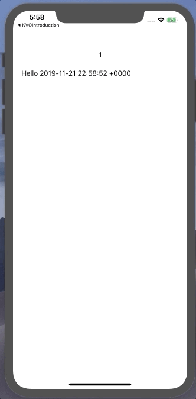

# Pursuit-Core-iOS-KVO-Lab

Build an app that sets a `Timer`, then displays the number of times it's been incremented as well as the current time.  Use KVO to observe the relevent properties on a model object that you build.

[Source link](https://www.ralfebert.de/)
